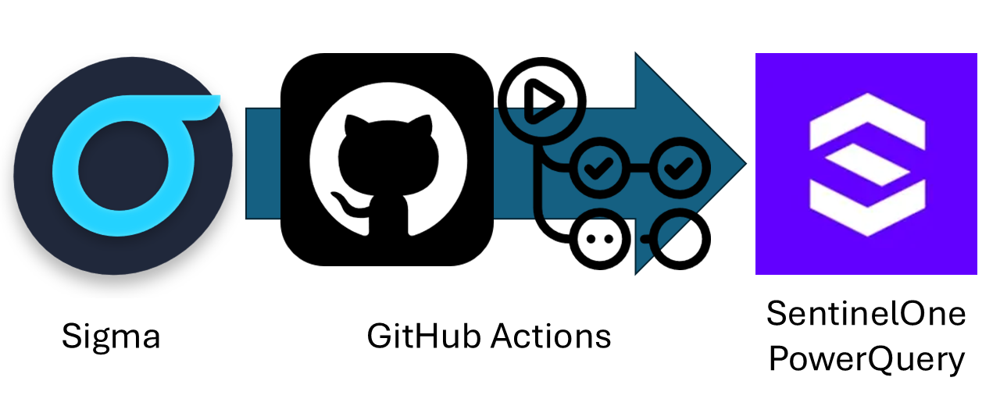

# ConvertSigmaRepo2SentinelOnePQ

Scripts stolen and heavily based on [rcegan/ConvertSigmaRepo2KQL](https://github.com/rcegan/ConvertSigmaRepo2KQL), played by GitHub Actions that converts Sigma rules to SentinelOne PowerQuery via PySigma.

## Usage

Firstly, modify the 'rules_directory' variable to reflect the location of your Sigma process creation rules. If using in CI/CD and you're cloning the Sigma repo in each time, you can leave this value as-is.

Next, modify the 'output_directory' to match whichever folder you want the rules to be dumped into. Expect over 1000+ results.

## Example
For GitHub Workflow, you can find an example of workflow here: [Example Workflow.md](Example Workflow.md)

To see what result [sigma-to-s1pq-converter-win_process_create_markdown.py](sigma-to-s1pq-converter-win_process_create_markdown.py) is generating, please look at [SentinelOne_PQ - Windows Process Creation/proc_creation_win_addinutil_uncommon_child_process.md](SentinelOne_PQ - Windows Process Creation/proc_creation_win_addinutil_uncommon_child_process.md)


## Dependencies
### sigma-to-s1pq-converter-win_process_create_markdown.py

1. Python Environment: Ensure you have Python installed on your system. You can download it from python.org.

2. Required Libraries:
        **os**: This is a standard library in Python, so no additional installation is needed.
        **datetime**: Also a standard library in Python.
        **sigma.rule**: This is part of the Sigma project. You need to install the Sigma library.
        **sigma.backends.sentinelone_pq**: This is a specific backend for Sigma, so you need to install the Sigma backends.

   You can install the Sigma library and its backends using pip:

    ```python
    pip install sigma
    pip install sigma-backends
    ```

3. Sigma Rules Directory: Ensure you have a directory containing Sigma rule files in YAML format. The script expects these files to be located in sigma/rules/windows/process_creation/.

4. Output Directory: The script creates an output directory named SentinelOne_PQ - Windows Process Creation if it doesn’t already exist. Ensure you have the necessary permissions to create directories and write files in the specified location.

5. File Handling: The script reads and writes files, so make sure the paths specified in rules_directory and output_directory are correct and accessible.

6. Error Handling: The script includes basic error handling to catch exceptions during file processing. Ensure you have proper error logging or handling mechanisms in place if you plan to run this script in a production environment.

### .github/workflows/sigma-to-s1pq-converter-win_process_create_markdown.yml

1. GitHub Account: Ensure you have a GitHub account and a repository where you can add this workflow.

2. GitHub Actions: Enable GitHub Actions in your repository settings.

3. Python Environment:
        The workflow sets up Python 3.10 using the actions/setup-python action.
        Ensure your script (sigma-to-s1pq-converter-win_process_create_markdown.py) is compatible with Python 3.10.

4. Required Libraries:

      **sigma-cli**: This is installed using pip install sigma-cli.

      **sigma-cli pipelines**: Installed using sigma plugin install sentinelone-pq.

5. Sigma Repository: The workflow clones the Sigma repository from GitHub. Ensure you have internet access to clone the repository.

6. Permissions: The workflow requires write permissions to the repository contents to commit and push changes.

7. Cron Schedule: The workflow is scheduled to run daily at midnight. Ensure the cron syntax ("0 0 * * *") is correct for your desired schedule.

8. Directory Structure:
        The workflow creates a directory named S1PQ - Windows Process Creation in the GitHub workspace.
        Ensure your script handles paths correctly and writes output to this directory.

9. GitHub Actions:
        actions/checkout@v4.2.0: Used to check out the repository code.
        actions/setup-python@v4.7.1: Used to set up the Python environment.
        stefanzweifel/git-auto-commit-action@v5: Used to commit and push changes automatically.

10. Script Execution: Ensure your script (sigma-to-s1pq-converter-win_process_create_markdown.py) is present in the repository and executable.


## Thanks
Many thanks to:
- [@SigmaHQ](https://github.com/SigmaHQ) for
    - [Sigma Rule Repository](https://github.com/SigmaHQ/sigma)
    - [pySigma](https://github.com/SigmaHQ/pySigma)
    - [sigma-cli](https://github.com/SigmaHQ/sigma-cli)
- [@rcegan](https://github.com/rcegan) for [rcegan/ConvertSigmaRepo2KQL](https://github.com/rcegan/ConvertSigmaRepo2KQL)
- [@7RedViolin](https://github.com/7RedViolin) for [7RedViolin/pySigma-backend-sentinelone-pq)](https://github.com/7RedViolin/pySigma-backend-sentinelone-pq)
